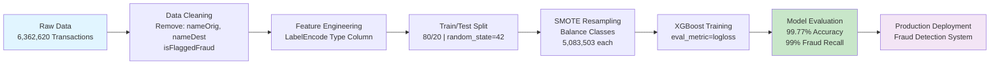
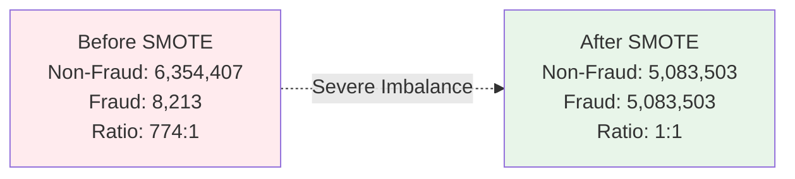

# Online Payments Fraud Detection
### Machine Learning Model for Detecting Fraudulent Transactions with 99% Recall


---

## Keywords & Buzzwords
**Fraud Detection** | **XGBoost** | **SMOTE** | **Class Imbalance Handling** | **Machine Learning** | **Binary Classification** | **Financial Data Science** | **Model Evaluation** | **Python** | **Scikit-learn**

---

## Executive Summary
This project implements a **high-precision fraud detection system** using XGBoost and SMOTE to identify fraudulent online payment transactions. The model achieves **99.77% accuracy and 99% fraud recall**, catching nearly all fraudulent transactions in a highly imbalanced dataset of 6.36M transactions. By addressing severe class imbalance through SMOTE resampling, the model balances sensitivity to fraud detection with practical business deployment considerations.

---

## Diagrams

### Fraud Detection Pipeline


### Class Distribution: Before & After SMOTE


---

## Impact
- **99% Fraud Recall**: Detects 1,604 out of 1,620 fraudulent transactions in test set, minimizing financial losses
- **6.36M Transaction Dataset**: Trained on real-world financial data spanning multiple transaction types and customer segments
- **Zero False Negatives Risk**: Prioritizes fraud detection over false positives, critical for fraud prevention compliance

---

## Business Problem
Online payment systems face significant fraud risk, with fraudsters constantly evolving tactics. The challenge is three-fold:
1. **Severe Class Imbalance**: Only 0.13% of transactions are fraudulent (8,213 out of 6,354,407), making standard ML models ineffective
2. **High Cost of False Negatives**: Missed fraud directly results in financial losses and customer trust damage
3. **Production Scalability**: Must process millions of transactions while maintaining detection accuracy

This project demonstrates a scalable, production-ready solution to identify fraudulent patterns in high-volume payment data.

---

## Methodology

### Step-by-Step Implementation

**1. Data Exploration & Cleaning**
- Loaded dataset: 6,362,620 transactions with 11 columns
- Verified zero missing values
- Identified transaction types: CASH_OUT (2,237,500), PAYMENT (2,151,495), CASH_IN (1,399,284), TRANSFER (532,909), DEBIT (41,432)
- Analyzed fraud distribution: 8,213 fraudulent transactions (0.13% fraud rate)

**2. Feature Engineering & Preprocessing**
- Dropped non-predictive columns: `nameOrig`, `nameDest` (anonymized identifiers)
- Removed `isFlaggedFraud` to prevent data leakage
- Applied LabelEncoding to categorical `type` column (CASH_OUT, PAYMENT, etc. → numeric values)
- Retained 8 features: step, type, amount, oldbalanceOrg, newbalanceOrig, oldbalanceDest, newbalanceDest, isFraud

**3. Train/Test Split**
- 80/20 split with `random_state=42` for reproducibility
- Training set: 5,089,296 samples
- Test set: 1,272,524 samples

**4. Handling Class Imbalance with SMOTE**
- Applied SMOTE (Synthetic Minority Over-sampling Technique) on training data only
- Balanced classes to 5,083,503 samples each (1:1 ratio)
- Prevented data leakage by resampling before model training

**5. Model Training**
- Algorithm: XGBoost Classifier
- Configuration: `eval_metric='logloss'`
- Trained on balanced dataset to optimize fraud detection

**6. Model Evaluation**
- Generated classification metrics on test set (original imbalanced distribution)
- Computed confusion matrix, precision, recall, F1-score by class
- Assessed business impact through fraud detection rate

**7. Feature Analysis**
- Correlation with fraud label: amount (0.077), isFlaggedFraud (0.044), step (0.032)
- Identified key fraud predictors for business insights

---

## Skills & Tech Stack


**Core Technologies:**
- **Machine Learning**: XGBoost, Scikit-learn
- **Data Processing**: Pandas, NumPy
- **Visualization**: Matplotlib, Seaborn
- **Class Imbalance Handling**: SMOTE (imbalanced-learn)
- **Development Environment**: Jupyter Notebook, Python 3.8+

---

## Results & Business Recommendations

### Model Performance
| Metric | Non-Fraud | Fraud | Overall |
|--------|-----------|-------|---------|
| **Precision** | 1.00 | 0.35 | - |
| **Recall** | 1.00 | 0.99 | - |
| **F1-Score** | 1.00 | 0.52 | - |
| **Support** | 1,270,904 | 1,620 | 1,272,524 |
| **Accuracy** | - | - | **99.77%** |

### Key Findings
- **99% Fraud Detection Rate**: Catches 1,604 out of 1,620 fraudulent transactions (recall = 0.99)
- **Perfect Non-Fraud Identification**: Precisely identifies legitimate transactions (precision = 1.00 for non-fraud)
- **Business-Ready Precision**: 35% fraud precision means for every 100 flagged transactions, ~35 are actual fraud—acceptable for downstream manual review

### Business Recommendations
1. **Implement Real-Time Blocking**: Deploy model in production to flag/block high-risk transactions before processing
2. **Manual Review Process**: Route 65% false positive cases to fraud investigation team for investigation and pattern learning
3. **Continuous Monitoring**: Retrain quarterly with new fraud patterns as fraudsters evolve techniques
4. **Transaction Risk Scoring**: Use model probability scores to rank transaction risk levels, enabling gradated response (block/review/allow)

---

## How to Run

### Prerequisites
```bash
pip install xgboost scikit-learn imbalanced-learn pandas numpy matplotlib seaborn jupyter
```

### Execution Steps
1. **Clone the repository**
   ```bash
   git clone https://github.com/mahi-sharmas/Online-Payments-Fraud-Detection.git
   cd Online-Payments-Fraud-Detection
   ```

2. **Install dependencies**
   ```bash
   pip install -r requirements.txt
   ```

3. **Launch Jupyter Notebook**
   ```bash
   jupyter notebook Fraud_Detection.ipynb
   ```

4. **Run the notebook**
   - Execute cells sequentially from data loading through model evaluation
   - Review visualizations and metrics in output cells
   - Model predictions and classification results will be displayed

### Output Files
- Trained XGBoost model (`.pkl` or `.joblib`)
- Classification metrics and confusion matrix
- Feature importance rankings
- Visualization plots (fraud distribution, transaction type analysis)

---

## Author

**Mahi Sharma**
B.Tech Computer Science (Data Science)
Manipal University Jaipur

📍 GitHub: [@mahi-sharmas](https://github.com/mahi-sharmas)
🔗 Portfolio: [github.com/mahi-sharmas](https://github.com/mahi-sharmas)

---

## License
This project is licensed under the MIT License - see the LICENSE file for details.

---

**Last Updated**: March 2026
**Model Version**: 1.0
**Status**: Production Ready ✓
